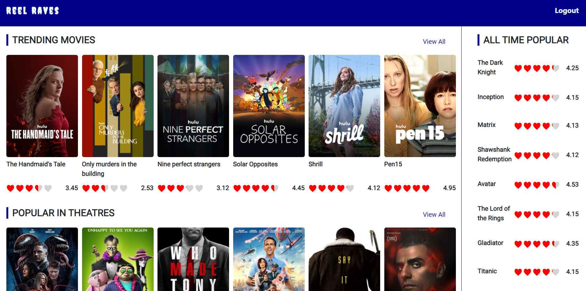

# Angular Movie Review 

## Reel Raves Web Application

<div>


</div>



### Environment Set up for Local Deployment (Recommended)

This project is developed with [Angular](https://angular.io/) and tested on [Visual Studio Code](https://code.visualstudio.com/).

**To run the application:**  
First, clone the repository into your local device, the directory should look something like this:

```
├── Final-project
|   ├── node-modules
```

Note: There are free tier for all the services listed above.

Next, in the terminal:

```
cd final-project
ng serve
```

### Features

### 1. **Discover the Latest Movies**
   Stay up-to-date with the latest movie releases. Our platform provides information on the hottest films hitting theaters.

### 2. **Comprehensive Movie Reviews**
   Dive into detailed and insightful movie reviews from both critics and fellow users. Get a holistic view of what the community thinks about each film.

### 3. **Personalized Recommendations**
   Receive personalized movie recommendations based on your viewing history and preferences. Discover hidden gems tailored just for you.

### 4. **User Ratings and Comments**
   Share your opinions! Rate movies and leave comments to engage with the community. Your voice matters, and we want to hear what you loved or disliked about a film.
---
